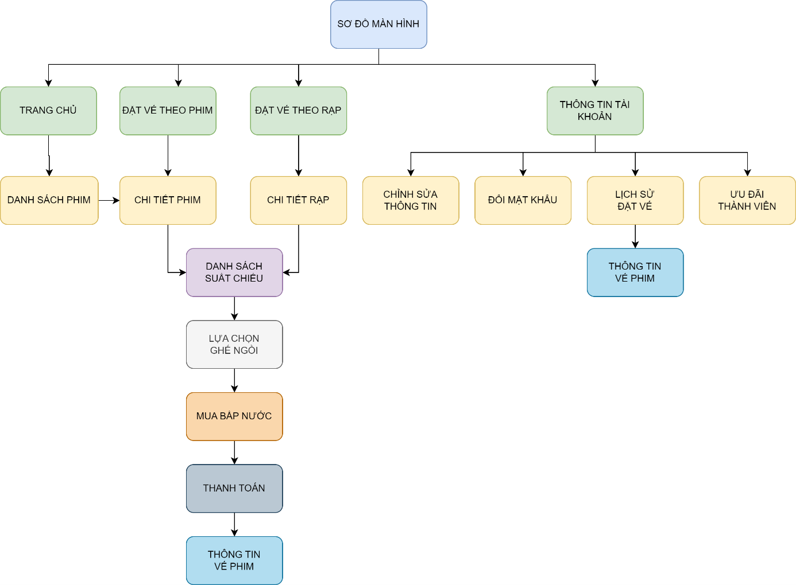
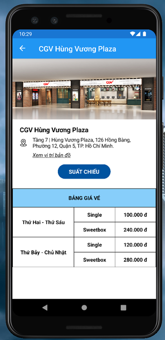
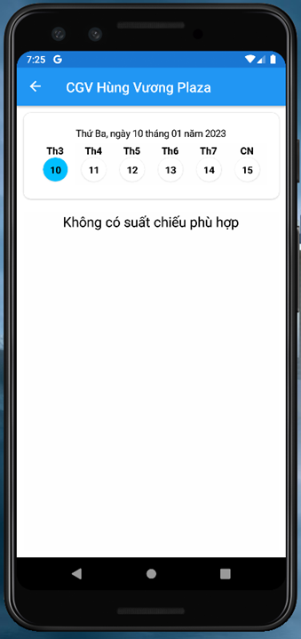
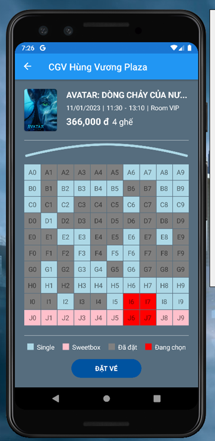

<h1 id="app-cinema-xamarin">App-Cinema-Xamarin</h1>

Công nghệ lập trình đa nền tảng cho ứng dụng di động - IE307.N11

<h2 id="s-m-n-h-nh">Sơ đồ màn hình</h2>

<h2 id="giao-di-n-ng-d-ng-tr-n-android">Giao diện ứng dụng trên Android</h2>

